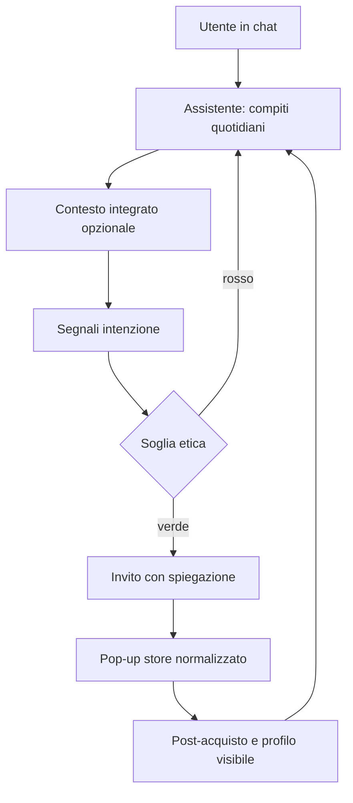

# 🛒 Senso (Byte Rush)

> **Senso emotivo + Sensazione = Senso ai tuoi acquisti.**

Senso è un assistente conversazionale personale, nato in un contesto di **Hackathon**, che si integra con i servizi quotidiani dell'utente (calendario, note, reminder) per costruire, nel tempo, una comprensione genuina dei suoi interessi e bisogni. 

Quando emerge un'intenzione d'acquisto **reale** nel contesto della conversazione, il chatbot propone prodotti in modo trasparente, non invasivo e sempre spiegato. 

*Lo shopping non è l'obiettivo dell'app — è una conseguenza naturale di una relazione di fiducia tra utente e assistente.*

---

## 🌟 Proposta di Valore

| Per l'Utente 👤 | Per il Brand 🏢 |
| :--- | :--- |
| **Un assistente che lo conosce davvero** | Accesso a utenti con intenzione d'acquisto reale |
| **Suggerimenti contestuali e spiegati** | Nessun dark pattern — solo vendite in target |
| **Controllo totale sui propri dati** | Conversioni estremamente più qualificate |
| **Shopping senza pressione** | Brand equity visiva (stesso stile UI per tutti) |

---

## 🏗 Architettura Principale

Il sistema è basato su un flusso architetturale che mette la privacy e la logica di raccomandazione etica al centro:

```text
┌─────────────────────────────────────┐
│            UTENTE                   │
│         (Chat UI)                   │
└────────────┬────────────────────────┘
             │
             ▼
┌─────────────────────────────────────┐
│         LLM Core                    │
│  (es. Claude API / GPT-4)           │
│  + memoria conversazionale          │
│  + profilo utente                   │
└────┬──────────────┬─────────────────┘
     │              │
     ▼              ▼
┌─────────┐   ┌─────────────────────┐
│Integrazi│   │  Recommendation     │
│oni      │   │  Engine             │
│Calendar │   │  (Soglia Etica      │
│Notes    │   │   inclusa)          │
│Reminder │   └──────────┬──────────┘
└─────────┘              │
                         ▼
              ┌─────────────────────┐
              │   Product Catalog   │
              │   API (Shopify /    │
              │   custom)           │
              └──────────┬──────────┘
                         │
                         ▼
              ┌─────────────────────┐
              │   Pop-up Store      │
              │   (UI normalizzata) │
              └─────────────────────┘
```

---

## Archetipo

L’**archetipo** di Senso non è “chatbot che vende”, ma **assistente relazionale con economia secondaria**. È il pattern che vogliamo replicare in ogni interazione coerente col prodotto.

| Fase | Cosa succede | Principio |
| :--- | :--- | :--- |
| **1. Relazione** | L’utente usa l’assistente per compiti quotidiani (pianificazione, note, benessere) senza obiettivo d’acquisto. | La conversazione è il prodotto primario. |
| **2. Contesto integrato** | Calendario, note e altre fonti (con consenso) arricchiscono il contesto solo quando servono a risposte utili. | Minimo necessario, spiegato, revocabile. |
| **3. Segnale d’intenzione** | Conversazione + dati integrati + storico indicano un bisogno concreto (non una curiosità passeggera). | Nessun suggerimento commerciale “a freddo”. |
| **4. Soglia etica** | Valutazione esplicita (stato emotivo, orario, acquisti recenti, saturazione suggerimenti). | Default: **non** proporre se c’è ambiguità. |
| **5. Invito contestuale** | Messaggio naturale + azione discreta (es. “Esplora opzioni”); ignorare / “non ora” / procedere sono scelte equipollenti. | Trasparenza e rispetto del rifiuto. |
| **6. Store normalizzato** | UI identica per tutti i brand; badge *Perché te lo mostriamo*; CTA **Acquista** e **Non ora** con parità visiva; niente urgenza artificiale. | Equità tra brand e autonomia dell’utente. |
| **7. Post-acquisto in chat** | Ordine, spedizione, resi e feedback restano nel filo della conversazione; la Carta d’Identità si aggiorna in modo visibile. | Fidiucia come ciclo chiuso, non come funnel. |

In sintesi: **fiducia → contesto → gate → invito → store neutro → follow-up**. Lo shopping è la **conseguenza** di questo arco, non il suo centro.



---

## 🛡️ Etica by Design: Criticità e Soluzioni

Il nostro recommendation engine integra una **Soglia Etica** intrinseca per garantire che la piattaforma non diventi mai un hub di manipolazione o di pressione all'acquisto.

### 1. Manipolazione Emotiva
* **Rischio:** Sfruttare stati emotivi negativi per spingere acquisti consolatori.
* **Soluzione:** Il sistema blocca in automatico i suggerimenti se l'utente esprime stress, tristezza o ansia; se sono le `23:00–06:00`; o se ha già acquistato prodotti simili negli ultimi 30 giorni.

### 2. Profiling Opaco
* **Rischio:** L'utente non sa cosa il sistema sa di lui.
* **Soluzione:** **Carta d'Identità** — una dashboard costantemente accessibile con gli interessi rilevati (e relative fonti di conversazione), storico dei suggerimenti, un bottone rapido *"Dimentica questo dato"* e export GDPR completo.

### 3. Shopping Compulsivo
* **Rischio:** La comodità e familiarità del chatbot aumentano la frequenza d'acquisto impulsivo.
* **Soluzione:** Budget tracker opzionale. Senso non mostra *mai* due suggerimenti commerciali nella stessa sessione. Dopo 3 acquisti in 30 giorni, appare un messaggio di riflessione (non bloccante).

### 4. Fiducia vs Monetizzazione
* **Rischio:** Senso viene percepito come un venditore travestito da amico.
* **Soluzione:** Ogni suggerimento presenta un badge **"Perché te lo mostriamo"** spiegato in linguaggio naturale. L'ordine dei prodotti è determinato *esclusivamente* dalla rilevanza contestuale, non esistono placement o priorità a pagamento per i brand.

### 5. Integrazione Dati di Terze Parti
* **Rischio:** L'accesso a calendario e note è invasivo e solleva dubbi di privacy.
* **Soluzione:** Autenticazione OAuth2 (o mock per il prototipo) con scope e permessi minimi richiesti (es. *read-only, solo eventi futuri*). 

---

## 🔄 Il Flusso Utente

### 1. Onboarding Progressivo *(Zero Friction)*
Si inizia a chattare senza creare account e senza fornire permessi. Il sistema raccoglie il contesto in modo colloquiale e chiede permessi (es. *"Vuoi che controlli il tuo calendario per aiutarti a pianificare la gara?"*) solo se e quando ha perfettamente senso. I consensi sono contestuali, mai presentati come un "muro" all'avvio dell'app.

### 2. Uso Quotidiano
L'utente pianifica la settimana o prende appunti liberamente. Senso analizza calendari, salute e note per fornire consigli *genuinamente gratuiti* (es. ritmo di allenamento per la gara). 
> ⚠️ **Regola fissa:** Nessun suggerimento commerciale nelle prime interazioni. Si costruisce la fiducia prima della vendita.

### 3. Rilevamento Intenzione
Il Recommendation Engine cerca l'intersezione perfetta tra: 
* **Pattern conversazionale** (es. ha parlato di running 3 volte di recente)
* **Contesto integrato** (gara in calendario prossima e aumento km percorsi)
* **Storico acquisti** (nessun acquisto recente di scarpe)
*Se i controlli della Soglia Etica (orario, stato emotivo) sono superati su luce verde, si procede.*

### 4. Suggerimento Contestuale
Appare un messaggio naturale e non intrusivo nella chat, ad esempio: *"Noto che ti stai preparando per la gara del 14 aprile 🏃 e le corse si intensificano. Vuoi esplorare alcune opzioni per le scarpe nuove?"* Il pulsante è un invito, non una Call to Action urlata. Ignorare, dire di no o cliccare sono tre scelte ugualmente accettate e valorizzate.

### 5. Il Pop-up Store Normalizzato
Un ambiente visivo equo, pulito e uguale per tutti i brand. Sono severamente vietate le dark patterns da e-commerce:
* ❌ Nessun Count-Down
* ❌ Niente *"Altri 3 utenti stanno guardando..."*
* ❌ Assenza totale di scarsità artificiale ("*Solo 1 pezzo rimasto!*")
* ❌ Nessun cross-sell o upsell aggressivo

Sono invece in evidenza: immagine del prodotto, prezzo, descrizione essenziale (no superlative, no urgenza), badge *"Perché te lo mostriamo"* e due CTA con **parità visiva**: **Acquista** / **Non ora**.

### 6. Relazione Post-Acquisto
Senso si occupa del post-vendita all'interno della medesima chat (tracking, resi fluidi, e un genuino *"Come sono andate le prime uscite con le scarpe nuove?"*). Il loop si chiude arricchendo passivamente e trasparentemente la Carta d'Identità dell'utente.

---

## 📈 Metriche di Successo (Etiche)

Senso ribalta le classiche KPI degli e-commere per dare priorità a:
- ✅ **NPS dell'assistente:** La fiducia generata è il vero e solo indicatore di successo primario.
- ✅ **% di suggerimenti rifiutati ("Non ora"):** Utilizzata coma spia diagnostica. Rifiuti alti = bassa rilevanza.
- ✅ **Tasso di reso post-acquisto:** Misura diretta della qualità del suggerimento.
- ✅ **Frequenza d'acquisto per utente:** Monitorata costantemente alla ricerca di early-warning per acquisti compulsivi.

---

## 💻 Tech stack (repository attuale vs. target)

**Implementato in questo repo (prototipo UI):**

- **Frontend:** Vite, React 18, TypeScript, Tailwind CSS 4, Motion, Lucide, Sonner.
- **Logica demo:** conversazione e cataloghi sono **mock** in memoria (keyword → risposta + `PopupStore`); non c’è ancora LLM né backend.

**Obiettivo architetturale (allineato all’archetipo):**

- **LLM core** con memoria conversazionale e profilo utente; **recommendation engine** con soglia etica.
- **Integrazioni:** calendario, note, reminder (OAuth2, scope minimi); catalogo prodotti via API (es. Shopify / custom).
- **Persistenza e Carta d’Identità:** es. backend + database e auth conformi a export GDPR e “dimentica questo dato”.

---

## 🚀 Come eseguire in locale (Getting Started)

1. **Clona il repository:**
   ```bash
   git clone https://github.com/CapoHHub/byte-rush.git
   cd byte-rush
   ```

2. **Installa le dipendenze:**
   ```bash
   npm install
   ```

3. **Avvia il server di sviluppo:**
   ```bash
   npm run dev
   ```
   L’app Vite è in genere su `http://localhost:5173` (porta indicata nel terminale).

4. **Build di produzione:**
   ```bash
   npm run build
   ```

Quando aggiungerai backend e LLM, documenta qui variabili d’ambiente (es. `.env.example`) e URL del servizio.
